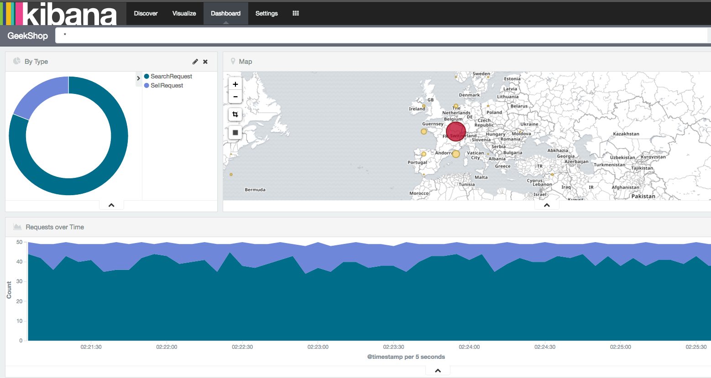
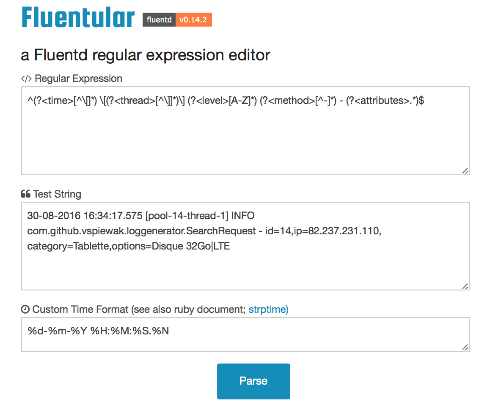

# Docker EFK stack

Playground to play with Fluentd and Elasticsearch+Kibana. Prepared for [Cloud-Native-Singapore](http://meetup.com/cloud-native-singapore) August 2016 meetup.

This is fully based on Jeff Sogolov's Presentation visualizing Logs using ElasticSearch and Kibana. 

[Video on Youtube](https://www.youtube.com/watch?v=Kqs7UcCJquM) &  [GitHub Repository](https://github.com/gsogol/docker-elk)

Sample Dashboard:



## Introduction

[slides](https://docs.google.com/presentation/d/1dGwlrXrcskHr09l79wty_CGrD_sqjZx8Gge7KxZI4b0/pub?start=false&loop=false&delayms=3000)

In a world of Ephemeral containers, how can we centralise the logs and get meaningfull analysis out of them?

One of the major struggles with any large deployment is logging. Having a central place to aggregate logs makes troubleshooting and analysis considerably easier to do.

As part of the presentation, this playground environment was created to get familiar with the log management tools leveraged by Kubernetes.

### The Kubernetes Logging Add-on

The official Kubernetes Provisioning scripts come with the option to deploy several add-ons. One such add-on is the Fluentd based log aggregation setup. 
In this setup, the goal is for every node in the cluster to forward the logs of its containers as well as its agent (Kubelet) to a log indexing service.

For the containers, the default Docker logging driver (json), captures all data sent to `stdout` and `stderr` and stores it in json files in a directory per container.
As part of starting containers, the Kubelet also ensures a symbolic link is created to each json log file in a central directory. It is this central directoy on the host node which 
the Fluentd agent, running itself in a container, is configured to monitor through a volume mount.

At the time of writing the logging add-on did not yet leverage the powerful DaemonSet controllers available in Kubernetes to ensure every cluster node ran a log shipping agent. Refer to the references
section below on how to deploy the Fluentd agents to each node using DaemonSets instead.

Additionally, as part of the logging add-on, a 2 node Elasticsearch cluster for indexing is deployed and exposed as an internal cluster service. It is important to note that this Elasticsearch
cluster does not follow the best practices of running Master, Client and Data Elasticsearch nodes recommended for performance and resiliency. 
Configuration and Manifest files to run a production ready ES cluster, with integrated Kubernetes [cloud discovery](https://github.com/fabric8io/elasticsearch-cloud-kubernetes) for the latest 
Elasticsearch version [are available](https://github.com/pires/kubernetes-elasticsearch-cluster) and should be considered as well.

Nevertheless, the Fluentd+Elasticsearch & Kibana (EFK) stack provides very powerful analysis, as will be demonstrated using the setup in this repository.

### This Repository Setup

To play with the full EFK stack locally, this repository currently leverages Docker Compose and Docker For Mac. 

A sample [log generato](https://github.com/vspiewak/log-generator) is used to simulate activity on a commercial website.
The stack defined in Docker Compose will stand up inter-connected Elasticsearch, Kibana, Fluentd and Log-Generator containers. 

The Fluentd configuration is mounted from the current working directory, allowing you to experiment with its settings to parse the provided sample logs.

## Running the playground

Contents of this repository:
```
.
├── Makefile                            Main Makefile to run demoscript
├── README.md                           This Readme
├── docker-compose.yaml                 Definition of Stack
├── fluentd                             fluentd container setup
│   ├── Dockerfile                      fluentd image recipe
│   ├── Makefile                        Build script for fluentd image
│   ├── elasticsearch-template.json     index template 
│   ├── fluent.conf                     fluend configuration
│   ├── fluentd.vim                     simple syntax highlighting
│   ├── plugins/                        placeholder for custom ruby parse scripts
│   └── versioning.mk                   versioning Makefile
├── kibana-sense                        Kibana container setup
│   ├── Dockerfile                      Kibana image with Sense plugin
│   ├── Makefile                        Build script for Kibana image
│   └── versioning.mk                   versioning Makefile
├── log-generator                       Sample Log generator
│   ├── Dockerfile                      OpenJDK based image recipe
│   ├── Makefile                        Build script for Log generator
│   ├── README.md                       original readme from log generator
│   ├── pom.xml                         Maven package
│   ├── src/                            Source for Log Generator
│   └── versioning.mk                   versioning Makefile
└── versioning.mk                       main versioning Makefile
```

### Log generator

Go to log-generator sub folder

Building:

```
make build
```

Run as a stand-alone container:

```
make run
```

Follow the logs generated:

```
make logs
```

Review the logs generated by this sample application to understand the data they contain. Notice IPs are present but no Geoip data exists.

Stop & Remove the container

```
make stop
```

### Kibana Image

Building the image:

```
make build
```

This is based on the official Kibana image, but with the Sense plug-in made available. 

### Fluentd Image

Building the image:
```
make build
```

### Full Stack

From the root directory:

Start Elasticsearch and create Index template:

```
make init
```

This will create the networks and persistent volume for Elasticsearch, it will automatically detect when Elasticsearch becomes available and run `curl -XPUT ...index-template.json` to create the index template for the log data sent by the Fluentd container

Bring up the full stack (Kibana/Fluentd & Log-Generator) - Note: it is required to run init first!

```
make up
```

Once all services started, You should be able to access [Kibana](http://localhost) on port 80 of your localhost (assuming port 80 is available)

Follow the logs generated by Fluentd:

```
make logs
```

You may now edit the `fluentd/fluent.conf` file on your local machine, to apply your config changes use:

```
make reload
```

If you are following the logs, you will notice the Fluentd container restarting and using the new configuration.

You may use Sense to understand the Elasticsearch data better


### Cleaning up / Resetting

Once finished, stop and remove all containers with:

```
make down
```

Delete the Elasticsearch data (Visualizations / Dashboards / Indices / ...)

```
make clean
```

## References

- [Kubernetes Intro by Ian Lews](https://www.openstack.org/summit/tokyo-2015/videos/presentation/in-a-world-of-ephemeral-containers-how-do-we-keep-track-of-things)
- [Kubernetes Logging Add-on](https://github.com/kubernetes/kubernetes/tree/v1.3.6/cluster/addons/fluentd-elasticsearch)
- [Running Fluentd as DaemonSets](https://github.com/kubernetes/kubernetes/issues/13313#issuecomment-234180205)
- [Logstash vs Fluentd](http://www.slideshare.net/td-nttcom/fluentd-vs-logstash-for-openstack-log-management)
- [Fluentd Regex Validator](http://fluentular.herokuapp.com/) 
- [Monitoring SLAs](https://www.elastic.co/guide/en/elasticsearch/guide/2.x/percentiles.html)
